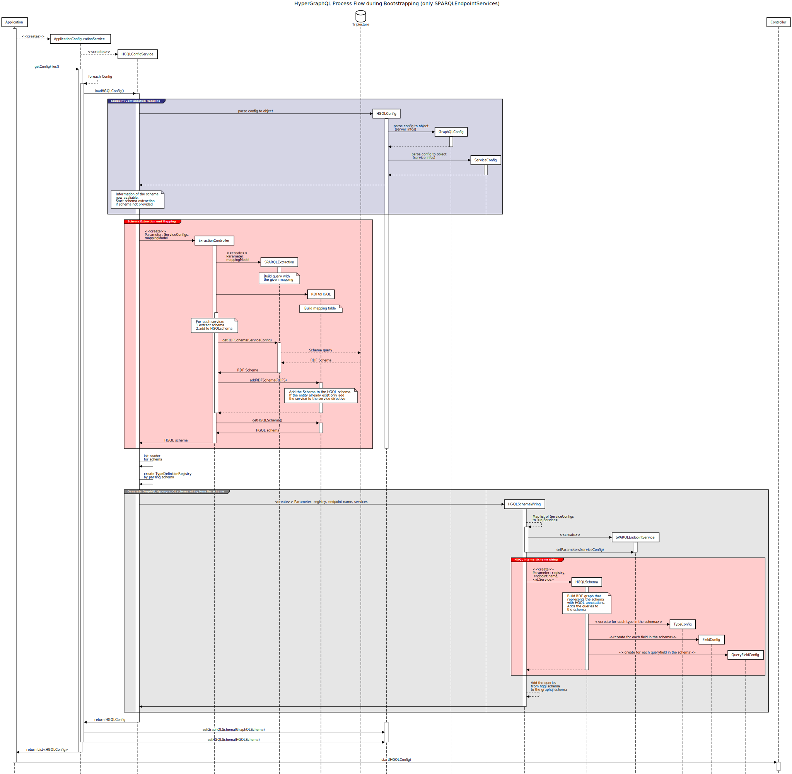

  HyperGraphQL
======

## New Features
- [Automatic Bootstrapping (through schema extraction)](./docs/bootstrapping.md)
- [multiple services per schema entity](./docs/multiple_service_feature.md)
- [Support of Unions](./docs/union.md)
- [Support of Interfaces](./docs/interface.md)
- [Placeholder Literal for fields with multiple output types including a String](./docs/Literal_placeholder.md)

## Process Flow of HyperGraphQL
### Bootstrapping and Initialization Phase
>
>ToDo: change colors

### Query Resolving
>
>ToDo: Correct misplaced arrows (arrow 51,52,53)

----------

## Old ReadMe file
HyperGraphQL is a [GraphQL](http://graphql.org) interface for querying and serving [linked data](https://www.w3.org/standards/semanticweb/data) on the Web. It is designed to support federated querying and exposing data from multiple linked data services using GraphQL query language and schemas. The basic response format is [JSON-LD](https://json-ld.org), which extends the standard JSON with the [JSON-LD context](https://json-ld.org/spec/latest/json-ld-api-best-practices/#dfn-json-ld-context) enabling semantic disambiguation of the contained data.

### Release
This is v1.0.3, a minor release that enables language support for query fragments and tidies some code.
### License note:
 This software has been developed and is maintained by [Semantic Integration Ltd.](http://semanticintegration.co.uk). It
          is released under Apache License 2.0. See [LICENSE.TXT](https://github.com/semantic-integration/hypergraphql/blob/master/LICENSE.TXT) for more infromation.
