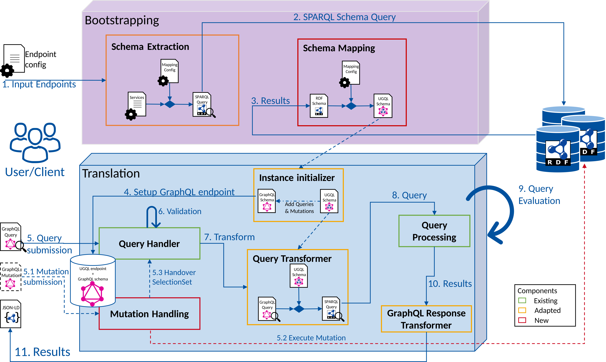

# Documentation
## Service Setup
|Link|Description|
|:------|:-------|
|[Configuration File](./config.md)|Detailed explaination of the configuration file|
|[Mapping Vocabulary](./schema_mapping.md)|Default mapping vocabulary ways to adjust it|
|[Extraction Query](./schema_extraction_query.md)|Default schema extraction query and explainations how to change the extraction query|

## Method of Operation
|Link|Description|
|:------|:-------|
|[Bootstrapping Phase](./bootstrapping.md)|Detailed explanation of the bootstrapping phase|
|[Translation Phase](./translation_phase.md)|Detailed explanation of the translation phase|
|[Mutations](./mutations.md)|Detailed explanation of the mutation support|
|[Query Modifiers](./query_modifiers.md)|Listing and explaination of all supported query modifiers|

## Technical Details
|Link|Description|
|:------|:-------|
|[Multiple Services](./multiple_service_feature.md)|Supporting multiple services per schema entity|
|[Literal Placeholder](./Literal_placehoilder.md)|Introducing the concept of the literla placeholder to support literal values on properties with multiple ranges|
|[Interface](./interface.md)|Support of interface types in the UGQLS|
|[Union](union.md)|Support of union types in the UGQLS|

## Evaluation / JUnit-Tests
|Link|Description|
|:------|:-------|
|[Performance Evaluation](../evaluation/evaluation.ipynb)|Performance Evaluation of UltraGraphQL|
|[JUnit-Tests](./evaluation/README.md)|Tests for different features of UGQL partly with detailed analyses|

