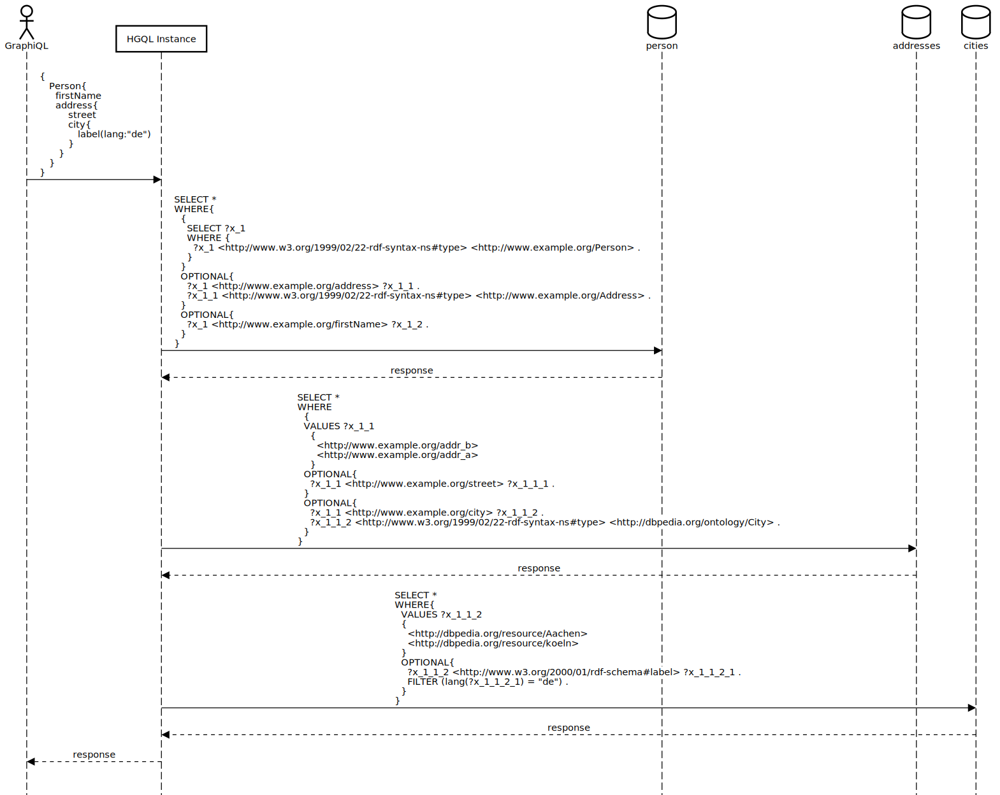

# Test of nested queries over multiple services
This test is preformed [here](../../src/test/java/org/hypergraphql/ApplicationTest.java) in the combinedServices() method.

## Test Setup
Three [datasets](#datasets) with interlinked data which allows nested queries to retrieve data from multiple services.
In one dataset is data about persons in another information about addresses and in the last information about cities.
The data is linked as follows: A Person has a address and a address has a city.

## Expected Outcome
The [nested query](#graphql-query) should extract the data from all services so that for each person the corresponding city is retrieved.

-----------------------------
## Process Flow



## Further Tests
- [combined services test with schema extraction](test_combined_services_with_extraction.md): same test setup but without a given schema

--------
## GraphQL Query
```graphql
{
    Person{
        firstName
        address{
            street
            city{
                label(lang: "de")
            }
        }
    }
}
```

## HGQL config
```json
{
  "name": "combined-service-test",
  "schema": "schema.sparql",
  "server": {
    "port": 8082,
    "graphql": "/graphql",
    "graphiql": "/graphiql"
  },
  "services": [
    {
      "id": "person",
      "type": "LocalModelSPARQLService",
      "filepath": "build/resources/test/evaluation/combined_services/person.ttl",
      "filetype":  "Turtle",
      "graph": ""
    },
    {
      "id": "address",
      "type": "LocalModelSPARQLService",
      "filepath": "build/resources/test/evaluation/combined_services/addresses.ttl",
      "filetype":  "Turtle",
      "graph": ""
    },
    {
      "id": "city",
      "type": "LocalModelSPARQLService",
      "filepath": "build/resources/test/evaluation/combined_services/cities.ttl",
      "filetype":  "Turtle",
      "graph": ""
    }
  ]
}
```

## HGQL Schema

```graphql
type __Context{
    City:           _@href(iri: "http://dbpedia.org/ontology/City")
    label:          _@href(iri: "http://www.w3.org/2000/01/rdf-schema#label")
    Person:         _@href(iri: "http://www.example.org/Person")
    lastName:       _@href(iri: "http://www.example.org/lastName")
    firstName:      _@href(iri: "http://www.example.org/firstName")
    address:        _@href(iri: "http://www.example.org/address")
    Address:        _@href(iri: "http://www.example.org/Address")
    street:         _@href(iri: "http://www.example.org/street")
    city:           _@href(iri: "http://www.example.org/city")
}

type Person  @service(id:"person"){
    label: [String]   @service(id:"person")
    lastName: [String]   @service(id:"person")
    firstName: [String]   @service(id:"person")
    address: [Address]   @service(id:"person")
}

type Address   @service(id:"address"){
    street: [String]   @service(id:"address")
    city: [City]   @service(id:"address")
}

type City   @service(id:"city"){
    label: [String]   @service(id:"city")
}
```

## Datasets

### Person Dataset
```turtle
@prefix rdf:   <http://www.w3.org/1999/02/22-rdf-syntax-ns#> .
@prefix rdfs:  <http://www.w3.org/2000/01/rdf-schema#> .
@prefix ex:   <http://www.example.org/> .

ex:Alice a ex:Person ;
        rdfs:label "Alice";
        ex:lastName "Hellmann";
        ex:firstName "Alice";
        ex:address ex:addr_a .

ex:addr_a a ex:Address .
ex:addr_b a ex:Address .

ex:Bob a ex:Person ;
       rdfs:label "Bob";
       ex:lastName "Rivest";
       ex:firstName "Bob" ;
        ex:address ex:addr_b .


```
### Address Dataset
```turtle
@prefix rdf:   <http://www.w3.org/1999/02/22-rdf-syntax-ns#> .
@prefix rdfs:  <http://www.w3.org/2000/01/rdf-schema#> .
@prefix dbo:   <http://dbpedia.org/ontology/> .
@prefix dbr:   <http://dbpedia.org/resource/> .
@prefix ex:   <http://www.example.org/> .

ex:addr_a a ex:Address;
        ex:street "123 Fake Street";
        ex:city dbr:Aachen .

ex:addr_b a ex:Address;
          ex:street "742 Evergreen Terrace";
          ex:city dbr:koeln .

dbr:koeln  a dbo:City .
dbr:Aachen  a dbo:City .
```
### City Dataset
```turtle
@prefix dbo:   <http://dbpedia.org/ontology/> .
@prefix dbr:   <http://dbpedia.org/resource/> .
@prefix rdf:   <http://www.w3.org/1999/02/22-rdf-syntax-ns#> .
@prefix rdfs:  <http://www.w3.org/2000/01/rdf-schema#> .


dbr:Aachen  a       dbo:City ;
            rdfs:label  "Aachen"@de , "Aix-la-Chapelle"@fr.

dbr:koeln a dbo:City;
          rdfs:label "Köln"@de, "Colone"@en.
```
