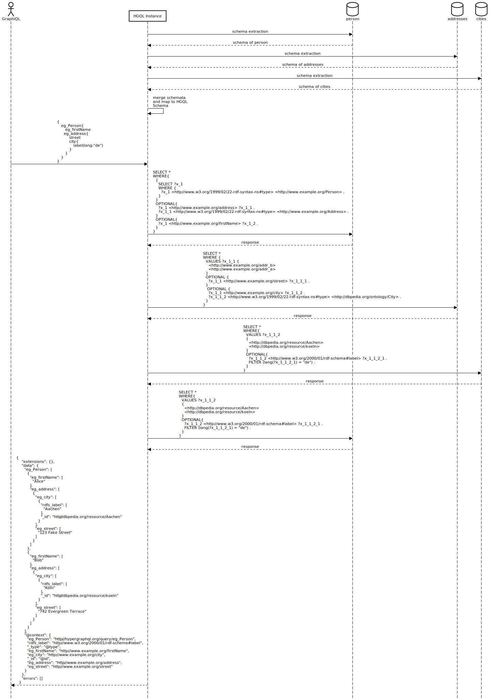

# Test the extraction of the schema over multiple services
This test is preformed [here](../../src/test/java/org/hypergraphql/ApplicationTest.java) in the combinedServicesWithExtraction() method.
## Test Setup
The same datasets as in the Test [combined_services](./test_combined_services.md) but with out the provided schema.
In one dataset is data about persons in another information about addresses and in the last information about cities.
The data is linked as follows: A Person has a address and a address has a city.
For the mapping and the schema extraction query the default was used.

## Expected Outcome
The HGQL service should extract the [schema](#extracted-hgql-schema) of all three datasets, to enable nested queries over all datasets.
The [query](#graphql-query) must extract for each person the label of the city of there address.

## Process Flow

## Extracted HGQL Schema
```sparql
type __Context{
	hgqls_Literal:	_@href(iri:"http://hypergraphql.org/schema/Literal")
	rdf_type:	_@href(iri:"http://www.w3.org/1999/02/22-rdf-syntax-ns#type")
	eg_lastName:	_@href(iri:"http://www.example.org/lastName")
	eg_Person:	_@href(iri:"http://www.example.org/Person")
	rdfs_label:	_@href(iri:"http://www.w3.org/2000/01/rdf-schema#label")
	eg_Address:	_@href(iri:"http://www.example.org/Address")
	dbo_City:	_@href(iri:"http://dbpedia.org/ontology/City")
	hgqls_value:	_@href(iri:"http://hypergraphql.org/schema/value")
	eg_firstName:	_@href(iri:"http://www.example.org/firstName")
	eg_city:	_@href(iri:"http://www.example.org/city")
	eg_address:	_@href(iri:"http://www.example.org/address")
	eg_street:	_@href(iri:"http://www.example.org/street")
}
interface eg_Person_Interface {
	eg_firstName: [String] @service(id: "person")
	eg_lastName: [String] @service(id: "person")
	eg_address: [eg_Address] @service(id: "person")
	rdf_type: [String] @service(id: ["address", "city", "person"])
	rdfs_label: [String] @service(id: ["city", "person"])
}
interface eg_Address_Interface {
	eg_city: [dbo_City] @service(id: "address")
	rdf_type: [String] @service(id: ["address", "city", "person"])
	eg_street: [String] @service(id: "address")
}
interface hgqls_Literal_Interface {
	hgqls_value: [String]
}
interface dbo_City_Interface {
	rdf_type: [String] @service(id: ["address", "city", "person"])
	rdfs_label: [String] @service(id: ["city", "person"])
}

type hgqls_Literal implements hgqls_Literal_Interface  {
 	hgqls_value: [String]
}
type eg_Person implements eg_Person_Interface @service(id: "person") {
 	eg_firstName: [String] @service(id: "person")
	eg_lastName: [String] @service(id: "person")
	eg_address: [eg_Address] @service(id: "person")
	rdf_type: [String] @service(id: ["address", "city", "person"])
	rdfs_label: [String] @service(id: ["city", "person"])
}
type eg_Address implements eg_Address_Interface @service(id: ["address", "person"]) {
 	eg_city: [dbo_City] @service(id: "address")
	rdf_type: [String] @service(id: ["address", "city", "person"])
	eg_street: [String] @service(id: "address")
}
type dbo_City implements dbo_City_Interface @service(id: ["address", "city"]) {
 	rdf_type: [String] @service(id: ["address", "city", "person"])
	rdfs_label: [String] @service(id: ["city", "person"])
}
```

## GraphQL Query
```graphql
{
  eg_Person{
  	eg_firstName
    eg_address{
      eg_street
    	eg_city{
        rdfs_label
      }
    }
  }
}

```

## GraphQL Response
```json
{
    "extensions": {},
    "data": {
      "eg_Person": [
        {
          "eg_firstName": [
            "Alice"
          ],
          "eg_address": [
            {
              "eg_city": [
                {
                  "rdfs_label": [
                    "Aachen"
                  ],
                  "_id": "http://dbpedia.org/resource/Aachen"
                }
              ],
              "eg_street": [
                "123 Fake Street"
              ]
            }
          ]
        },
        {
          "eg_firstName": [
            "Bob"
          ],
          "eg_address": [
            {
              "eg_city": [
                {
                  "rdfs_label": [
                    "Köln"
                  ],
                  "_id": "http://dbpedia.org/resource/koeln"
                }
              ],
              "eg_street": [
                "742 Evergreen Terrace"
              ]
            }
          ]
        }
      ],
      "@context": {
        "eg_Person": "http://hypergraphql.org/query/eg_Person",
        "rdfs_label": "http://www.w3.org/2000/01/rdf-schema#label",
        "_type": "@type",
        "eg_firstName": "http://www.example.org/firstName",
        "eg_city": "http://www.example.org/city",
        "_id": "@id",
        "eg_address": "http://www.example.org/address",
        "eg_street": "http://www.example.org/street"
      }
    },
    "errors": []
  }
```
## HGQL configuration
```json
{
  "name": "combined-service--with-extraction-test",
  "extraction": true,
  "mapping": "mapping.ttl",
  "query": "query.sparql",
  "server": {
    "port": 8082,
    "graphql": "/graphql",
    "graphiql": "/graphiql"
  },
  "services": [
    {
      "id": "person",
      "type": "LocalModelSPARQLService",
      "filepath": "build/resources/test/evaluation/combined_services/person.ttl",
      "filetype": "Turtle",
      "graph": ""
    },
    {
      "id": "address",
      "type": "LocalModelSPARQLService",
      "filepath": "build/resources/test/evaluation/combined_services/addresses.ttl",
      "filetype": "Turtle",
      "graph": ""
    },
    {
      "id": "city",
      "type": "LocalModelSPARQLService",
      "filepath": "build/resources/test/evaluation/combined_services/cities.ttl",
      "filetype": "Turtle",
      "graph": ""
    }
  ]
}
```

## Datasets

### Person Dataset
```turtle
@prefix rdf:   <http://www.w3.org/1999/02/22-rdf-syntax-ns#> .
@prefix rdfs:  <http://www.w3.org/2000/01/rdf-schema#> .
@prefix ex:   <http://www.example.org/> .

ex:Alice a ex:Person ;
        rdfs:label "Alice";
        ex:lastName "Hellmann";
        ex:firstName "Alice";
        ex:address ex:addr_a .

ex:addr_a a ex:Address .
ex:addr_b a ex:Address .

ex:Bob a ex:Person ;
       rdfs:label "Bob";
       ex:lastName "Rivest";
       ex:firstName "Bob" ;
        ex:address ex:addr_b .


```
### Address Dataset
```turtle
@prefix rdf:   <http://www.w3.org/1999/02/22-rdf-syntax-ns#> .
@prefix rdfs:  <http://www.w3.org/2000/01/rdf-schema#> .
@prefix dbo:   <http://dbpedia.org/ontology/> .
@prefix dbr:   <http://dbpedia.org/resource/> .
@prefix ex:   <http://www.example.org/> .

ex:addr_a a ex:Address;
        ex:street "123 Fake Street";
        ex:city dbr:Aachen .

ex:addr_b a ex:Address;
          ex:street "742 Evergreen Terrace";
          ex:city dbr:koeln .

dbr:koeln  a dbo:City .
dbr:Aachen  a dbo:City .
```
### City Dataset
```turtle
@prefix dbo:   <http://dbpedia.org/ontology/> .
@prefix dbr:   <http://dbpedia.org/resource/> .
@prefix rdf:   <http://www.w3.org/1999/02/22-rdf-syntax-ns#> .
@prefix rdfs:  <http://www.w3.org/2000/01/rdf-schema#> .


dbr:Aachen  a       dbo:City ;
            rdfs:label  "Aachen"@de , "Aix-la-Chapelle"@fr.

dbr:koeln a dbo:City;
          rdfs:label "Köln"@de, "Colone"@en.
```
