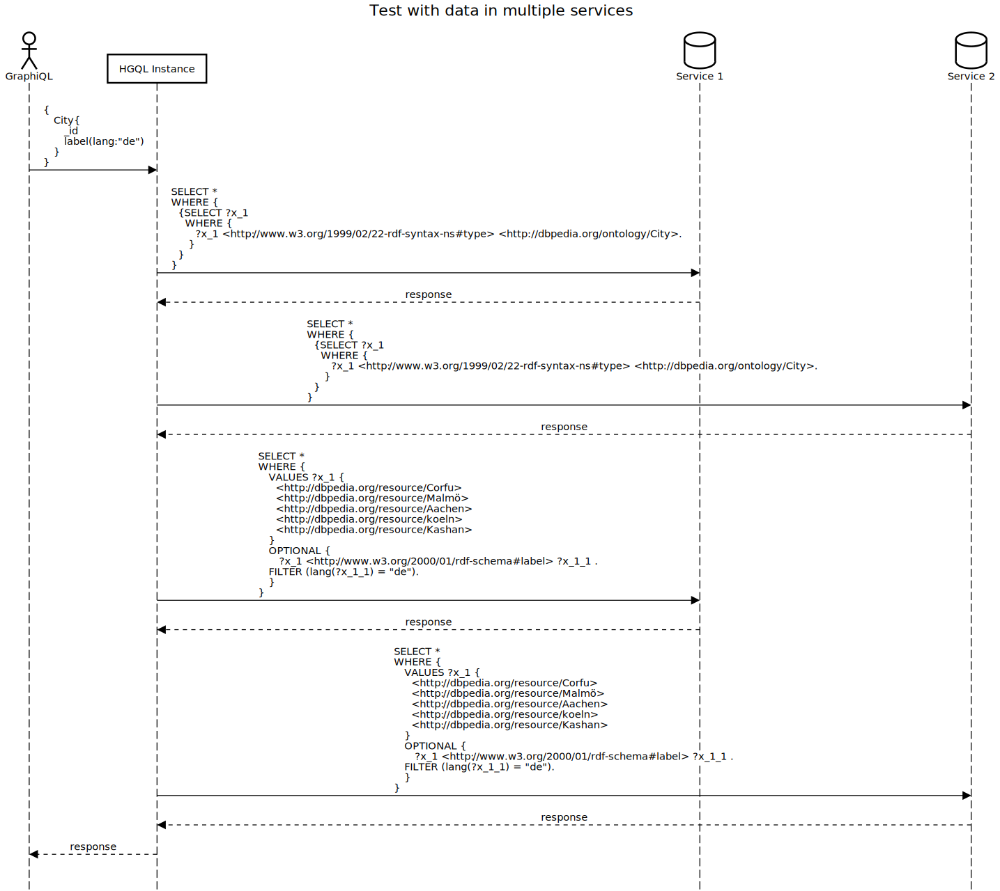

# Test of multiple services per schema entity
This test is preformed [here](../../src/test/java/org/hypergraphql/ApplicationTest.java) in the multipleServiceTest() method.
## Test setup
Two [datasets](#used-datasets) containing disjoint data, but encoded with the same schema, about cities.
For this test the [HGQL schema](#hgql-schema) is provided and the objectTypes and fields of the schema have two responsible services.

## Expected Outcome
The HGQL instance is [queried](#graphql-query) to get all cities there IDs and labels. It is expected that cities and label of the cities will be queried from both services and returned as one response.

## Process Flow
The GraphQL [query](#graphql-query) is translated in multiple separate SPARQL queries to extract the data from the SPARQL endpoints.
At first all cities and therefore there ID is queried from both services. 
The queried cities are then used as values to query the requested field of the objectType.
In this case both services are queried to get the label information because in the schema both services were defined as the responsible services.
It is also possible to define a arbitrary service that stores the label information.

> Note: The amount of VALUES per SPARQL query is limited to a certain threshold. 
>If the number of the values is greater then this threshold then multiple queries are executed to distribute the values over the queries.





## Further Tests
- [multiple service extended Test](test_multiple_service_extended.md): objectType and field data are stored separate from each other. This means that service_1 needs service_2 to get all requested data and vice versa.
-------------------------------------------------
## GraphQL Query
The Query extracts all cities with there id and german label. 
```graphql
{
    City{
        _id
        label(lang:"de")
    }   
}
```

## HGQL Response
The Response to the [query](#graphql-query) contains as expected cities and labels from both services.
```json
{
  "extensions": {},
  "data": {
    "City": [
      {
        "label": [
          "Aachen"
        ],
        "_id": "http://dbpedia.org/resource/Aachen"
      },
      {
        "label": [
          "Korfu"
        ],
        "_id": "http://dbpedia.org/resource/Corfu"
      },
      {
        "label": [
          "Köln"
        ],
        "_id": "http://dbpedia.org/resource/koeln"
      },
      {
        "label": [
          "Kaschan (Stadt)"
        ],
        "_id": "http://dbpedia.org/resource/Kashan"
      },
      {
        "label": [
          "Malmö"
        ],
        "_id": "http://dbpedia.org/resource/Malmö"
      }
    ],
    "@context": {
      "_type": "@type",
      "_id": "@id",
      "City": "http://hypergraphql.org/query/City",
      "label": "http://www.w3.org/2000/01/rdf-schema#label"
    }
  },
  "errors": []
}

```
## HGQL configurtation file
```json
{
  "name": "multiple-service-test",
  "schema": "test_services/schema_multiple_services.graphql",
  "server": {
    "port": 8080,
    "graphql": "/graphql",
    "graphiql": "/graphiql"
  },
  "services": [
    {
      "id": "service_1",
      "type": "LocalModelSPARQLService",
      "filepath": "build/resources/test/test_services/dataset_1.ttl",
      "filetype":  "Turtle",
      "graph": ""
    },
    {
      "id": "service_2",
      "type": "LocalModelSPARQLService",
      "filepath": "build/resources/test/test_services/dataset_2.ttl",
      "filetype":  "Turtle",
      "graph": ""
    }
  ]
}
```

## HGQL Schema
```graphql
type __Context {
    City:           _@href(iri: "http://dbpedia.org/ontology/City")
    label:          _@href(iri: "http://www.w3.org/2000/01/rdf-schema#label")
}

type City @service(id:["service_1","service_2"]) {
    label: [String] @service(id:["service_1","service_2"])
}


```

## Used Datasets

Dataset 1 accessed through service_1:
```turtle
@prefix dbo:   <http://dbpedia.org/ontology/> .
@prefix dbr:   <http://dbpedia.org/resource/> .
@prefix rdf:   <http://www.w3.org/1999/02/22-rdf-syntax-ns#> .
@prefix rdfs:  <http://www.w3.org/2000/01/rdf-schema#> .


dbr:Aachen  a       dbo:City ;
            rdfs:label  "Aachen"@de , "Aix-la-Chapelle"@fr.

dbr:koeln a dbo:City;
          rdfs:label "Köln"@de, "Colone"@en.
```

Dataset 2 accessed through service_2
```turtle
@prefix dbo:   <http://dbpedia.org/ontology/> .
@prefix dbr:   <http://dbpedia.org/resource/> .
@prefix rdf:   <http://www.w3.org/1999/02/22-rdf-syntax-ns#> .
@prefix rdfs:  <http://www.w3.org/2000/01/rdf-schema#> .

dbr:Kashan  a       dbo:City ;
        rdfs:label  "Kashan"@nl , "Kashan"@en , "Kashan"@fr , "カーシャーン"@ja , "Kashan"@it , "Kashan"@es , "Kashan"@pt , "Kaschan (Stadt)"@de , "Kaszan"@pl , "كاشان"@ar .

dbr:Corfu  a        dbo:City ;
        rdfs:label  "Korfoe (eiland)"@nl , "ケルキラ島"@ja , "Corfou"@fr , "Korfu"@de , "Korfu"@pl , "كورفو"@ar , "Corfù"@it , "Corfú"@es , "Corfu"@en , "Corfu"@pt .

dbr:Malmö  a        dbo:City ;
        rdfs:label  "Malmö"@pl , "Malmö"@de , "Malmö"@it , "Malmö"@en , "Malmö"@pt , "Malmö"@fr , "Malmö"@es , "مالمو"@ar , "マルメ"@ja , "Malmö (stad)"@nl .
```