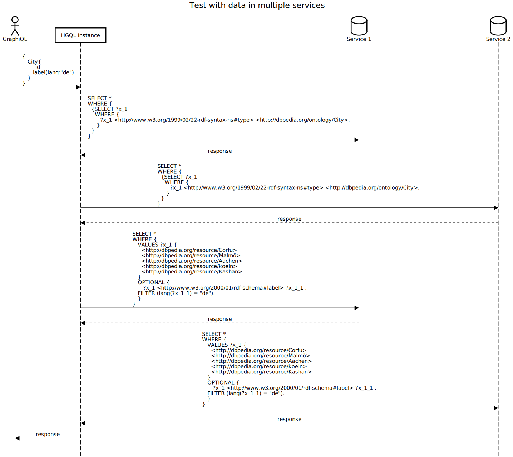

# Test Interlinking of ObjectType and Field Over Multiple Services
This test is preformed [here](../../src/test/java/org/hypergraphql/ApplicationTest.java) in the multipleServiceTestExtended() method.
>The test conducted here is curently only possible for fields of the root quey field (distance one from the query field), because for sub
## Setup
Two [datasets](#datasets) about cities and there labels but each service only contains the city and the information for the labels of the city are stored in the other service.
This means if only one service is queried only the city (_id) will be returned because the dataset does NOT contain any data of the labels for the cities in the dataset.

## Expected Outcome
Since both services are assigned for the objectType city and the field label it is expected that each city is returned with the corresponding label.
The union of both datasets contains labels for each city, so the query response must also contain the labels.

--------------------
## Process Flow
The GraphQL [query](#graphql-query) is translated in multiple separate SPARQL queries to extract the data from the SPARQL endpoints.
At first all cities and therefore there ID is queried from both services.
The queried cities are then used as values to query the requested field of the objectType.
In this case both services are queried to get the label information because in the schema both services were defined as the responsible services.
It is also possible to define a arbitrary service that stores the label information.
Data of the labels are queried from both services and for all cities that have been previously queried because the SPARQL query for the objectType *city* and the field *label* are separate.

> Note: The amount of VALUES per SPARQL query is limited to a certain threshold.
>If the number of the values is greater then this threshold then multiple queries are executed to distribute the values over the queries.





## Further Tests
- [multiple service Test](test_multiple_service.md): objectType and field data are stored in the same service but the whole data is distributed over two services
-------------------------------------------------
## GraphQL Query
The Query extracts all cities with there id and german label.
```graphql
{
    City{
        _id
        label(lang:"de")
    }
}
```

## HGQL Response
The Response to the [query](#graphql-query) contains as expected cities and labels from both services.
```json
{
  "extensions": {},
  "data": {
    "City": [
      {
        "label": [
          "Aachen"
        ],
        "_id": "http://dbpedia.org/resource/Aachen"
      },
      {
        "label": [
          "Korfu"
        ],
        "_id": "http://dbpedia.org/resource/Corfu"
      },
      {
        "label": [
          "Köln"
        ],
        "_id": "http://dbpedia.org/resource/koeln"
      },
      {
        "label": [
          "Kaschan (Stadt)"
        ],
        "_id": "http://dbpedia.org/resource/Kashan"
      },
      {
        "label": [
          "Malmö"
        ],
        "_id": "http://dbpedia.org/resource/Malmö"
      }
    ],
    "@context": {
      "_type": "@type",
      "_id": "@id",
      "City": "http://hypergraphql.org/query/City",
      "label": "http://www.w3.org/2000/01/rdf-schema#label"
    }
  },
  "errors": []
}

```

## HGQL Configuration
```turtle
{
  "name": "multiple-service-test-extended",
  "schema": "schema_multiple_services.graphql",
  "server": {
    "port": 8080,
    "graphql": "/graphql",
    "graphiql": "/graphiql"
  },
  "services": [
    {
      "id": "service_1",
      "type": "LocalModelSPARQLService",
      "filepath": "build/resources/test/evaluation/multiple_service_extended/dataset_1.ttl",
      "filetype":  "Turtle",
      "graph": ""
    },
    {
      "id": "service_2",
      "type": "LocalModelSPARQLService",
      "filepath": "build/resources/test/evaluation/multiple_service_extended/dataset_2.ttl",
      "filetype":  "Turtle",
      "graph": ""
    }
  ]
}
```

## Datasets
### Dataset 1
```turtle
@prefix dbo:   <http://dbpedia.org/ontology/> .
@prefix dbr:   <http://dbpedia.org/resource/> .
@prefix rdf:   <http://www.w3.org/1999/02/22-rdf-syntax-ns#> .
@prefix rdfs:  <http://www.w3.org/2000/01/rdf-schema#> .


dbr:Aachen  a dbo:City .
dbr:koeln a dbo:City .

dbr:Kashan  rdfs:label  "Kashan"@nl , "Kashan"@en , "Kashan"@fr , "カーシャーン"@ja , "Kashan"@it , "Kashan"@es , "Kashan"@pt , "Kaschan (Stadt)"@de , "Kaszan"@pl , "كاشان"@ar .

dbr:Corfu  rdfs:label  "Korfoe (eiland)"@nl , "ケルキラ島"@ja , "Corfou"@fr , "Korfu"@de , "Korfu"@pl , "كورفو"@ar , "Corfù"@it , "Corfú"@es , "Corfu"@en , "Corfu"@pt .

dbr:Malmö  rdfs:label  "Malmö"@pl , "Malmö"@de , "Malmö"@it , "Malmö"@en , "Malmö"@pt , "Malmö"@fr , "Malmö"@es , "مالمو"@ar , "マルメ"@ja , "Malmö (stad)"@nl .
```
### Dataset 2
```turtle
@prefix dbo:   <http://dbpedia.org/ontology/> .
@prefix dbr:   <http://dbpedia.org/resource/> .
@prefix rdf:   <http://www.w3.org/1999/02/22-rdf-syntax-ns#> .
@prefix rdfs:  <http://www.w3.org/2000/01/rdf-schema#> .

dbr:Kashan  a dbo:City .
dbr:Corfu  a dbo:City .
dbr:Malmö  a dbo:City .

dbr:Aachen  rdfs:label  "Aachen"@de , "Aix-la-Chapelle"@fr.

dbr:koeln rdfs:label "Köln"@de, "Colone"@en.
```
