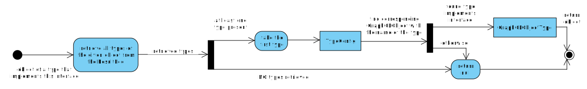

# HyperGraphQL Interface Support
HGQL supports the basic GraphQL interface functionalities.
In the schema a interface is defined as follows:
```GraphQL
interface Pet{
 name: String
 age: Int
}
type Dog implements Pet{
 name: String
 age: Int
 color: String
}
type Cat implements Pet{
 name: String
 age: Int
}
```
The interfaces defined in HGQLS have the same meaning as in GraphQL.
This means that a interface defines a set of fields a type MUST have if it implements the interface.
If a field has a interface as OutputType then the fields of the interface can be queried in the SelectionSet of the field and furthermore type specific fields can be queried within InlineFragments.
By querying a field with an interface as output all types that implement this interface are queried.
Example:
```GraphQL
type Person{
  firstName:
  owns: [Pet]
}
```
```GraphQL
{
  Person{
    firstName
    owns{
      name
      age
      ...on Dog{
        color
      }
    }
  }
}
```
In this example the name and age of all pets of all persons is queried and for the dogs also the color is queried.

GraphQL allows to define blank interfacs which will be enriched by HGQL with the *_id* and *_type* field.
As usual in HGQL only objectType and fields need a defiend service, services that are defined for interfaces or unions will be ignored.

>Currently NOT supported:
>-  union extend features
>- interface implementing interfaces (NOT supported by graphql-java)

## Implementation
HGQL has interpreted unions and interfaces as objectTypes, which had allowed to define these types in the schema but it was not possible to use these types in the intended way.
To add interfaceTypes to the HGQLSchema and then to the GraphQL schema, the queries are validated against, the information about these types have to be inserted into the rdfSchema.
The rdfSchema is an RDF dataset containing information about the HGQLSchema.
With this dataset HGQLSchema objects are created like *FieldConfig*, *FieldOfTypeConfig*, *QueryFieldConfig* and the *TypeConfig*.
These objects contain information about the whole HGQL Schema and are used during the query resolving.
The TypeConfig class is for all types of the schema and therefore functionalities for unions and interfaces were missing.
Now a TypeConfig object can be specified to be a UNION , INTERFACE or OBJECT to support the needed functions.

The created HGQLSchema is then used to generate a GraphQLSchema object.
Therefore the fields and objects are used to generate corresponding GraphQL objects like *GraphQLFieldDefinition* and *GraphQLObjectType*.
To support unionTypes and interfaceTypes the TypeConfig has to checked to generate either a *GraphQLObjectType*, *GraphQLUnionType* or a *GraphQLInterfaceType*.
GraphQLInterfaceType is initialised with the name and a TypeResolver.
This TypeResolver is needed during the data fetching to decide of which type an object is.

>InterfaceType TypeResolver logic:
>
>


For querying the SPARQLEndpoints the GraphQL query is transformed into a [Json representation](#hgql-json-query-representation) of the query containing SPARQL specific information like the SPARQL query variable name of a type and field.
Because all results of the SPARQL query are stoared in a ResultPool, the structure and order of the SPARQL queries is irrelevant for the GraphQL response.
In GraphQL queries with a interface as OutputType can have fields of the types outside the InlineFragments this means that the InlineFragments only contain type specific fields or are used to query specific types. If fields of the interface are queried outside a InlineFragment all types that implement this interface MUST be queried.
Therefore "virtual" fields are created for each type that implements the interface. The SelectionSet of the virtual field is composed of the queried fields of the interface and the for this type defined typespecific fields. As shown in the diagram below the Json representation is then generated for each virtual field.

>


## Current Limitation of Interfaces
The current implementation of the interfaces has the same limitations as the Union implementation.
