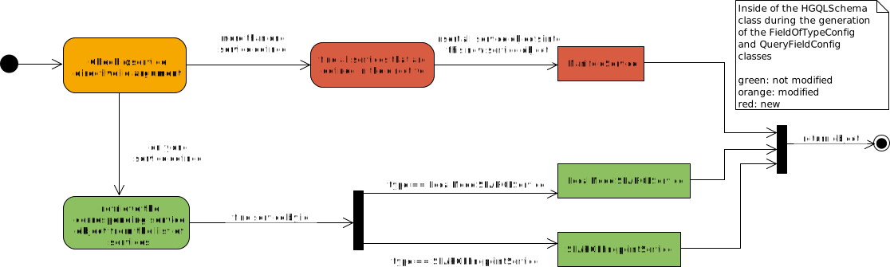
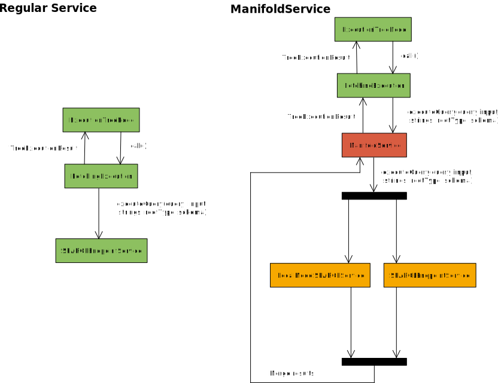
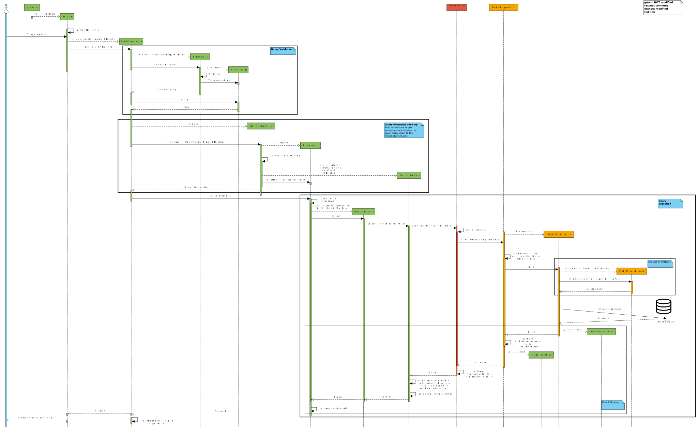

# Support of multiple services per schema entity

Instead of only one service per schema entity, like in HyperGraphQL, UGQL supports an array of services per schema entity.
If a field or type with multiple services is queried, the query is send to all defined services and the responses are merged.

## Supported service directives
>```hypergraphql
>@service(id: ["service_1","service_2","service_3"])
>@service(id: "service_1")
>```
For more than one service id a array MUST be used.


## Implementation

The support of multiple services is realized with an internal service object the new **ManifoldService**.
This service contains a list of service objects consisting of *LocalModelSPARQLService* or *SPARQLEndpointService* objects.
The ManifoldService inherits from the Service class and therefore is accessible through the service interface.
This is used to forward the service method calls to the services stored in a ManifoldService.
The results of these method calls are then merged to return a unified result.

### Creation
A ManifoldService object is created in the HGQLSchema class during the process of assigning Services to *FieldOfConfig* and *QueryFieldConfig* objects.
Here the *@service* directive is checked to find the id of the service that is responsible for the schema entity.
With the support for multiple services the directive argument id can now also be an array containing multiple service ids.
As shown in the diagram below the argument is checked if more than one id is given.
If only one service ID is given it is proceeded as usual.
Otherwise, a ManifoldService is created containing all service objects that correspond to the ids in the array.


>
>Decision diagram when a ManifoldService is created


### Usage
Thanks to the same interface as other services a ManifoldService fits without many modifications in the current processflow of the query resolving.
During the query resolving the ExecutionTreeNode is responsible for querying a given sub-query.
This sub-query can be the root Field of a query or a field of a sub-query.
If the parent field of the query has a type as output type  the ExecutionTreeNode object selects all fields of the selection set (sub-fields) that have the same service and creates ExecutionTreeNodes for all subfields.
The created ExecutionTreeNodes are stored in the "forest" of the ExecutionTreeNode.
Therefore, a ExecutionTreeNode is directly only responsible for one Service object.
As shown in the diagram below the ExecutionTreeNode initiates the query execution by calling the FetchingExecution.
The FetchingExecution is a wrapper class to make services a Callable class to function with Futures.
This means the ExecutionTreeNode object starts the query execution and initiates the query execution of the forest that contains the queries for the subfields that have a different service.
The sub-queries are provided by the ExecutionTreeNode parent object with the needed values for the sub-queries.
To support multiple services per schema entity the ManifoldService is inserted between the FetchingExecution and the regular services to coordinate the queries and to perform a result merging.
Incoming executeQuery() calls arrive now at the ManifoldService object that forward the call to the services the object stores.
Have all services answered the call the results are merged and returned.
Instead of one Service, now multiple services are queried with the same query.


>
>Interactions with a ManifoldService object


#### Detailed view of the query resolving 
>
>Path through the UGQL instance a query takes during execution
