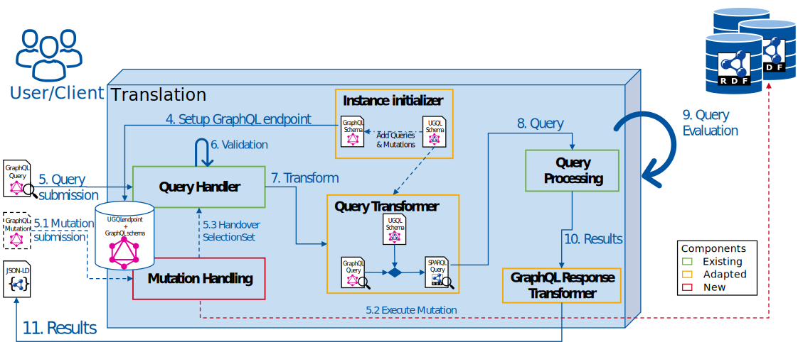
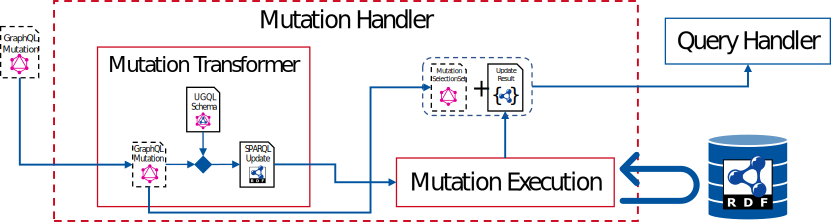
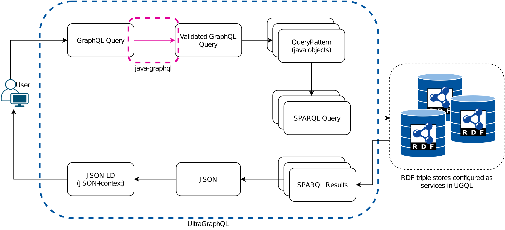
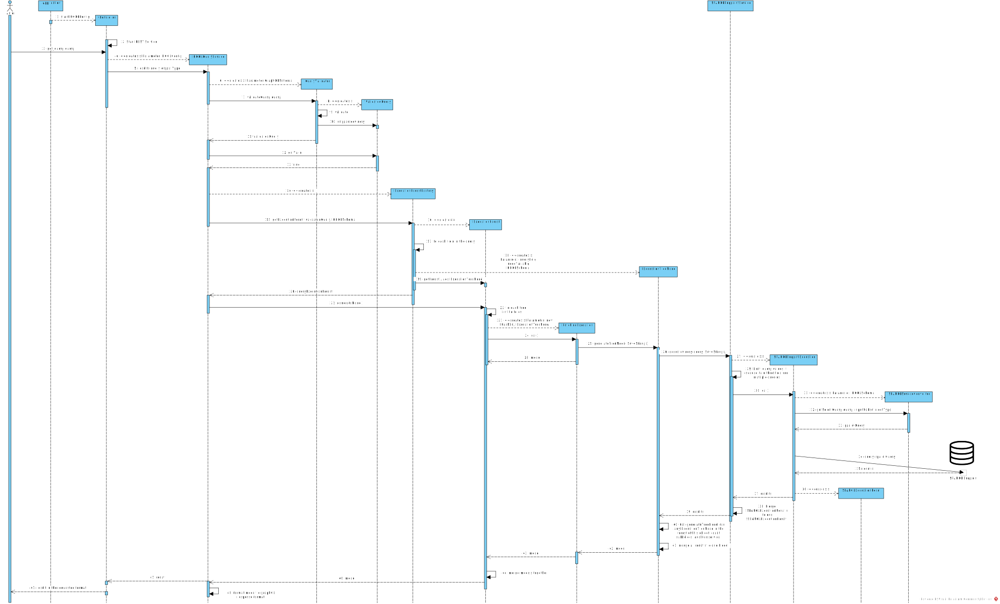

# Translation Phase

In the translation phase, received queries and mutations are translated to corresponding SPARQL queries and updates and executed against the services defined in the configuration. 
If a query requests data from multiple services the query is broken down to subqueries depending on the services defined in the UGQL schema (UGQLS). 
Therefore a SPARQL query for a service only queries information that are assigned to the service in the UGQLS. 
A detailed description of the SPARQL query translation is provided in the Section [Query Translation](#query-translation). 
As shown in Figure 1 the translation phase begins with converting the UGQLS into a GraphQL schema by adding the query and mutation fields.
Furthermore, additional field arguments and input types are added that are needed for the query and mutation writing.
After the GraphQL schema is generated it is exposed at the UGQL endpoint and serves the user or tools like GraphiQL for simplified query writing.
Internally the schema is used to validate incoming GraphQL requests, as depicted in step 6 in Figure 1 and analogously for the mutations.

>Figure 1: Abstract component overview of the translation phase
>
>

## Query Translation
The query translation depends on the underlying schema. 
For example if only one service is configured the whole GQL query is translated into one SPARQL query. 
If multiple services are defined the query might be translated into multiple queries depending on the queried entities. 
In the following the query translation is explained based on a example which is based on the following simplified UGQLS.

```graphql
type ex_Person @service(id:"service_1"){
    ex_name: [String] @service(id:"service_1")
    ex_age: [String] @service(id:"service_2")
    ex_address: [ex_Address] @service(id:"service_1")
    ex_owns: [ex_Car] @service(id:"service_4")
}
type ex_Address @service(id:"service_3"){
    ex_street: [String] @service(id:"service_3")
}
type ex_Car @service(id:"service_4"){
    ex_model: [String] @service(id:"service_4")
    ex_color: [String] @service(id:["service_1", "service_4"])
}
```
### Querying One Service
By querying the name of all persons only data from **service 1** is
queried and as explained above is only translated into one SPARQL query.

```graphql
ex_Person{
    ex_name
}
```

The Query is converted to the following SPARQL query:

```sparql
PREFIX ex: <http://example.org/>
SELECT *
WHERE {
    {
        SELECT *
        WHERE {
            ?x_1 a ex:Person.
        }
    }
    OPTIONAL{
        ?x_1 ex:name ?x_1_1.
    }
}
```
> Note: The actual SPARQL query does not use prefixes. They were used in the examples to increase the readability. Also the formatting may vary

The root query is always wrapped into a separate select clause and fields are queried in the optional clause. 
If the field has as output type a object type of the schema a type check is added to the query.
If the output type is a interface or union then the translation is altered.
In the case that no specific type is queried virtual fields are added during the translation for all possible output types and if specific types are queried only for those types virtual fields are added.
These virtual fields query information separately and the resulty of these fields are transformed according to the GraphQL schema therefore they are only used internally. 
More detailed information about the query translation in these cases can be found in the [union test](evaluation/union_test.md) and [interface test](evaluation/interface_test.md).

### Querying Multiple Services
Querying schema entities that have different services assigned results in multiple queries. 
The following query queries information from four different services.

```graphql
ex_Person{
    ex_name
    ex_age
    ex_address{
        ex_street
    }
    ex_owns{
        ex_model
    }
}
```
Similar to the case with only one service the first query extracts the information about all persons there IRI, name and IRI of there addresses since this information is also in **service 1**.
Resulting in a similar query to the example with one service:

```sparql
PREFIX ex: <http://example.org/>
SELECT *
WHERE {
    {
        SELECT *
        WHERE {
            ?x_1 a ex:Person.
        }
    }
    OPTIONAL{
        ?x_1 ex:name ?x_1_1.
    }
}
```

With the IRIs of the persons and the address the next queries are generated.
The information about the age of a person is located at **service 2** and needs the IRIs of the persons to link the infomation together resulting in the following query.

```sparql
PREFIX ex: <http://example.org/>
SELECT *
WHERE {
    VALUES ?x_1 {
        <http://example.org/bob>
        ...
      }
    OPTIONAL{
        ?x_1 ex:age ?x_1_2.
    }
}
```

The subquery for the car model a person owns is translated similarly with an additional type check and fields resulting in the following query.

```sparql
PREFIX ex: <http://example.org/>
SELECT *
WHERE {
    VALUES ?x_1 {
        <http://example.org/bob>
        ...
      }
    OPTIONAL{
        ?x_1 ex:owns ?x_1_4.
        OPTIONAL{
            ?x_1_4 ex:model ?x_1_4_1.
        }
    }
}
```

For the subquery querying the street name the IRI of the person is not needed since the IRI of the address is unique. 
If multiple persons share the same address (IRI) the street of the address is only queried once.
Resulting in the following query where the queried address IRIs of the first query are included as values.

```sparql
PREFIX ex: <http://example.org/>
SELECT *
WHERE {
    VALUES ?x_1_3 {
        <http://example.org/addr_a>
        ...
      }
    OPTIONAL{
        ?x_1_3 ex:street ?x_1_3_1.
    }
}
```

#### Distributed Data

In the case of distributed data a queried schema entity has multiple services in this case the all assigned services must be queried and the results are merged. 
The merging of the results is done before a subquery relying on this schema entity is translated and executed because as explained above the subqueries depend on the results of there root field. 
Detailed information about the implementation of this feature can be found [here](./multiple_service_feature.md) and detailed information about the query translation [here](./evaluation/test_multiple_service.md).

## Mutation Translation

Mutations in GraphQL consist of the mutation action and a defined selection set.
The mutation action is either an insertion or a deletion based on the input given in the mutation.
The selection set is a query after the mutation action is executed.
Currently UltraGraphQL only supports mutation actions against on service but the query is executed against all defined services.
The service is defined in the [configuration](./config.md).

UGQL generates for all object types in the UGQLS a *insert* and *delete* mutation field.
For input data the arguments of the fields contain use the same or equivalent names to the fields of the objects.
Furthermore, the output types of the fields stay the same for scalar values and in case of objects they are translated to equivalent input types that were generated during the generation of the GQLS (Figure 1).
In the case the output type is a union or interface the input type field or argument is split up to all possible output types meaning that for each possible output type a new field or argument is generated.
This step of breaking up the interface and union structure is needed because GraphQL does not allow interfaces or unions as output types of input types and arguments.

The example in the following demonstrates how the UGQLS is translated to the corresponding GQLS.
>UGQLS shown in this example is not valid since the context type and implementation of the own interface is missing. It is a shortent abstract of a valid UGQLS.

```graphql
type ex_Person @service(id:"service_1"){
    ex_name: [String] @service(id:"service_1")
    ex_age: [String] @service(id:"service_2")
    ex_address: [ex_Address] @service(id:"service_1")
    ex_owns: [ex_owns_OutputType] @service(id:"service_4")
}
type ex_Address @service(id:"service_3"){
    ex_street @service(id:"service_3")

type ex_Bike @service(id:"service_5"){
    ex_frame: [String] @service(id:"service_5")
    ex_model: [String] @service(id:"service_5")
    ex_color: [String] @service(id:"service_5")
}
type ex_Car @service(id:"service_4"){
    ex_model: [String] @service(id:"service_4")
    ex_color: [String] @service(id:["service_1", "service_4"])
}
interface ex_owns_OutputType{
    ex_model: [String]
    ex_color: [String]
}
```

Resulting GQLS:
>The GQLS in this example is simplified and misses field and object arguments for the query filtering.

```graphql
mutation{
    insert_ex_Person(
        _id: ID!
        ex_name: [String], 
        ex_age: [String], 
        ex_address: [input_ex_Address], 
        ex_owns_as_ex_Bike: [input_ex_Bike],
        ex_owns_as_ex_Car: [input_ex_Car])
    delete_ex_Person(
        _id: ID
        ex_name: [String], 
        ex_age: [String], 
        ex_address: [input_ex_Address], 
        ex_owns_as_ex_Bike: [input_ex_Bike],
        ex_owns_as_ex_Car: [input_ex_Car])
    insert_ex_Address(
        _id: ID!
        ex_street: [String])
    delete_ex_Address(
        _id: ID
        ex_street: [String])
    insert_ex_Bike(
        _id: ID!
        ex_frame: [String],
        ex_model: [String],
        ex_color: [String])
    delete_ex_Bike(
        _id: ID
        ex_frame: [String],
        ex_model: [String],
        ex_color: [String])
    insert_ex_Car(
        _id: ID!
        ex_model: [String],
        ex_color: [String])
    delete_ex_Car(
        _id: ID
        ex_model: [String],
        ex_color: [String])
}

input input_ex_Person{
    _id: ID!
    ex_name: [String]
    ex_age: [String]
    ex_address: [ex_Address]
    ex_owns: [ex_owns_OutputType]
}
input input_ex_Address{
    _id: ID!
    ex_street
}
input input_ex_Bike{
    _id: ID!
    ex_frame: [String]
    ex_model: [String] 
    ex_color: [String]
}
input input_ex_Car{
    _id: ID!
    ex_model: [String]
    ex_color: [String]
}
interface ex_owns_OutputType{
    _id: ID
    ex_model: [String]
    ex_color: [String]
}
type ex_Person @service(id:"service_1"){
    _id: ID
    ex_name: [String]
    ex_age: [String]
    ex_address: [ex_Address]
    ex_owns: [ex_owns_OutputType]
}
type ex_Address @service(id:"service_3"){
    _id: ID
    ex_street
}

type ex_Bike implements ex_owns_OutputType{
    _id: ID
    ex_frame: [String]
    ex_model: [String] 
    ex_color: [String]
}
type ex_Car implements ex_owns_OutputType{
    _id: ID
    ex_model: [String]
    ex_color: [String]
}

```

With the generation of the input types of all object types complex mutations are possible.
For example the insertion of multiple nested objects with a single mutation.
In the following example the a person is inserted with a nested object containing information about the person.
If the address would already exist only the _id would be required.

```graphql
mutation{
    insert_ex_Person(
        _id:"https://example.org/bob",
        ex_name:"Bob",
        ex_address{
            _id:"https://example.org/addr_a",
            ex_street: "Evergreen Terrace 742"
        })
}
```

As shown in **Figure 2** a received mutation is translated into an SPARQL update and executed against the defined service.
The result of the mutation execution and the selection set of the mutation are then forwarded to the query handler which executes the selection set as normal query.
The final result is than the result of the selection set combined with the result of the mutation.
Detailed information about the mutation translation can be found [here](./mutations.md)

>Currently the mutation fields only contatin the fields of there corresponding object type as arguments.
> The normal filtering features like limit, offset, and by _id are therefore, not possible for the root element of the selection set but for the rest of the selection set.
> A way to include is the normal filtering features into the root of the selection set is currently in construction.


>**Figure 2:**
>
>

## Internal Processing of an Query and Results

Any GraphQL query that the UGQL endpoint receives is validated against the GraphQL schema of the endpoint.
This validation is done by the java-graphql library.
If the query is invalid an error message is returned to the user.
The validated query is then transformed into a java object structure of the query which contains the SPARQL variable names for the queried entities and also splits the query into subqueries for the different services as explained in section [Query Translation](#query-translation).
As shown in **Figure 3** the set of generated query structure is then transformed into the actual SPARQL queries. The order of the translation and execution of the queries depends on the order of the GQL query since nested queries depend on the results of their parent query.

The SPARQL results that are returned by the triple store are then translated into JSON-like structure.
Results of queries for different input-values or executed at different services are mered with the corresponding objects avoiding the generation of duplicate data.
Before the final JSON result is build the filter operations are applied.
As explained earlier some of the filter operations can not be translated to SPARQL if executed on multiple SPARQL endpoints.

>If the *offset* term is defined in a query then the generated SPARQL queries
> do not contain the offset because if multiple services are defined the
> offset in the SPARQL queries could lead to an incorrect query response.
> Therefore, the offset is only applied during the final result build-up.

 As shown in **Figure 3** the context of the query result is appended to the JSON result after the result is build-up to its final form.

> **Figure 3:**
>
>

For a detailed view of the process flow of a query execution consider
consider the diagram in section [Detailed Process Flow of a Query Execution](#detailed-process-flow-of-a-query-execution).

Further details about the quer and result translation can be found on the following pages:

|Link|Description|
|---------------|-------------------------|
| [Interface](./interface.md)| Explaination of the Interface integration into UGQL. The translation of interfaces and unions requires a altered translation of the query and the results.|
|[Literal placeholder](./Literal_placeholder.md)| The concept of the literal placeholder object enables the querying of string values of properties with multiple ranges and therefore requires a special translation of the query and the result.|
|[Multiple services](./multiple_service_feature.md)| Assigning multiple services to one schema entity does not interfere with the direct query translation, but it changes the partition of the query into sub-queries and also requires to merge the results|

### Detailed Process Flow of a Query execution




