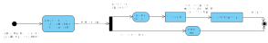
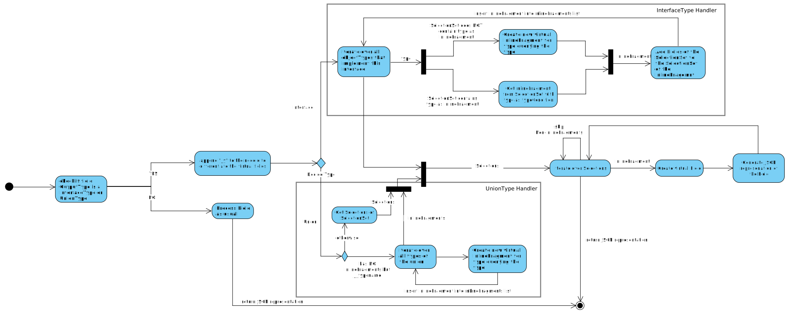
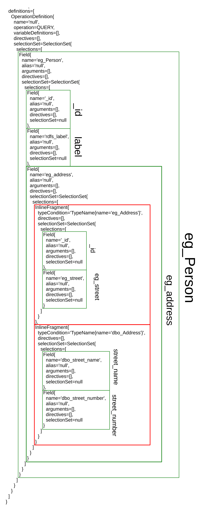

# UltraGraphQL Union Support

UGQL supports the basic GraphQL union functionalities.
In the schema a union is defined as follows:

```GraphQL
union animal = dog | cat
type dog{}
type cat{}
```

The members of a union MUST be a objectType and MUST be defined in the schema.
Unions are used to define that a output type of a field has multiple possible output types.
In GraphQL those fields are queried as follows:

```GraphQL
{ Person{
     owns{
        ... on dog{
                name
                breed
        }
        ... on cat{
                name
        }
     }
 }
}
```

>Currently NOT supported are union extend features

## Example
This example is a in-depth analysis of the [UnionTest](./evaluation/union_test.md).

## Implementation of Unions in UGQL 1.0.0
UGQL has interpreted unions and interfaces as objectTypes, which had allowed to define these types in the schema but it was not possible to use these types in the intended way.
To add unionTypes to the HGQLSchema and then to the GraphQL schema, the queries are validated against, the information about these types have to be inserted into the rdfSchema.
The rdfSchema is an RDF dataset containing information about the HGQLSchema.
With this dataset HGQLSchema objects are created like *FieldConfig*, *FieldOfTypeConfig*, *QueryFieldConfig* and the *TypeConfig*.
These objects contain information about the whole HGQL Schema and are used during the query resolving.
The TypeConfig class is for all types of the schema and therefore functionalities for unions and interfaces were missing.
Now a TypeConfig object can be specified to be a UNION , INTERFACE or OBJECT to support the needed functions.

The created HGQLSchema is then used to generate a GraphQLSchema object.
Therefore the fields and objects are used to generate corresponding GraphQL objects like *GraphQLFieldDefinition* and *GraphQLObjectType*.
To support unionTypes and interfaceTypes the TypeConfig has to checked to generate either a *GraphQLObjectType*, *GraphQLUnionType* or a *GraphQLInterfaceType*.
GraphQLUnionType is initialised with the name, memberTypes and a TypeResolver.
This TypeResolver is needed during the data fetching to decide of which type an object is.

>UnionType TypeResolver logic:
>
>

Considering the Example from below one innput for the TypeResolver would be *http://www.example.org/addr_a* and the TypeResolver now queries the ResultPool to find the type of this object.
Due to the structure and design of RDF *http://www.example.org/addr_a* could have multiple types. This problem is explained in detail [here](#current-limitation-of-unions).

For querying the SPARQLEndpoints the GraphQL query is transformed into a [Json representation](#hgql-json-query-representation) of the query containing SPARQL specific information like the SPARQL query variable name of a type and field.
Because all results of the SPARQL query are stoared in a ResultPool, the structure and order of the SPARQL queries is irrelevant for the GraphQL response.
Therefore a field with a union as output is translated into virtual fields of this field. For each InlineFragment a new "virtual" Field is created with a own id and the selectionSet for one Type. For each virual Field the Json representaion is generated and then merged together. This process is shown in the diagram below.
>


### UGQL Schema
```GraphQL
type __Context{
	dbo_address:	_@href(iri:"http://dbpedia.org/ontology/address")
	rdf_type:	_@href(iri:"http://www.w3.org/1999/02/22-rdf-syntax-ns#type")
	eg_Person:	_@href(iri:"http://www.example.org/Person")
	eg_label:	_@href(iri:"http://www.example.org/label")
	rdfs_label:	_@href(iri:"http://www.w3.org/2000/01/rdf-schema#label")
	eg_Address:	_@href(iri:"http://www.example.org/Address")
	dbo_street_number:	_@href(iri:"http://dbpedia.org/ontology/street_number")
	dbo_Address:	_@href(iri:"http://dbpedia.org/ontology/Address")
	dbo_street_name:	_@href(iri:"http://dbpedia.org/ontology/street_name")
	dbo_Person:	_@href(iri:"http://dbpedia.org/ontology/Person")
	eg_street:	_@href(iri:"http://www.example.org/street")
	eg_address:	_@href(iri:"http://www.example.org/address")
}
interface dbo_Address_Interface {
	rdf_type: [String] @service(id: "dataset_1")
	dbo_street_name: [String] @service(id: "dataset_1")
	dbo_street_number: [String] @service(id: "dataset_1")
}
interface eg_Person_Interface {
	rdf_type: [String] @service(id: "dataset_1")
	dbo_address: [dbo_address_OutputType] @schema(sameAs: "eg_address") @service(id: "dataset_1")
	rdfs_label: [String] @service(id: "dataset_1") @schema(sameAs: "eg_label")
	eg_address: [eg_address_OutputType] @schema(sameAs: "dbo_address") @service(id: "dataset_1")
	eg_label: [String] @service(id: "dataset_1") @schema(sameAs: "rdfs_label")
}
interface eg_Address_Interface {
	rdf_type: [String] @service(id: "dataset_1")
	eg_street: [String] @service(id: "dataset_1")
}
interface dbo_Person_Interface {
	rdf_type: [String] @service(id: "dataset_1")
	dbo_address: [dbo_address_OutputType] @schema(sameAs: "eg_address") @service(id: "dataset_1")
	rdfs_label: [String] @service(id: "dataset_1") @schema(sameAs: "eg_label")
	eg_address: [eg_address_OutputType] @schema(sameAs: "dbo_address") @service(id: "dataset_1")
	eg_label: [String] @service(id: "dataset_1") @schema(sameAs: "rdfs_label")
}
union dbo_address_OutputType = dbo_Address | eg_Address
union eg_address_OutputType = dbo_Address | eg_Address
type eg_Person implements dbo_Person_Interface & eg_Person_Interface @schema(sameAs: "dbo_Person") @service(id: "dataset_1") {
 	rdf_type: [String] @service(id: "dataset_1")
	dbo_address: [dbo_address_OutputType] @schema(sameAs: "eg_address") @service(id: "dataset_1")
	rdfs_label: [String] @service(id: "dataset_1") @schema(sameAs: "eg_label")
	eg_address: [eg_address_OutputType] @schema(sameAs: "dbo_address") @service(id: "dataset_1")
	eg_label: [String] @service(id: "dataset_1") @schema(sameAs: "rdfs_label")
}
type eg_Address implements eg_Address_Interface @service(id: "dataset_1") {
 	rdf_type: [String] @service(id: "dataset_1")
	eg_street: [String] @service(id: "dataset_1")
}
type dbo_Address implements dbo_Address_Interface @service(id: "dataset_1") {
 	rdf_type: [String] @service(id: "dataset_1")
	dbo_street_name: [String] @service(id: "dataset_1")
	dbo_street_number: [String] @service(id: "dataset_1")
}
type dbo_Person implements dbo_Person_Interface & eg_Person_Interface @schema(sameAs: "eg_Person") @service(id: "dataset_1") {
 	rdf_type: [String] @service(id: "dataset_1")
	dbo_address: [dbo_address_OutputType] @schema(sameAs: "eg_address") @service(id: "dataset_1")
	rdfs_label: [String] @service(id: "dataset_1") @schema(sameAs: "eg_label")
	eg_address: [eg_address_OutputType] @schema(sameAs: "dbo_address") @service(id: "dataset_1")
	eg_label: [String] @service(id: "dataset_1") @schema(sameAs: "rdfs_label")
}
```

### GraphQL Query
```GraphQL
{
  eg_Person{
    _id
    rdfs_label
    eg_address{
      ... on eg_Address{
        _id
        eg_street
      }
      ... on dbo_Address{
        _id
        dbo_street_name
        dbo_street_number
      }
    }
  }
}
```

### GraphQL Query Representation
```
Document{
  definitions=[
    OperationDefinition{
      name='null',
      operation=QUERY,
      variableDefinitions=[],
      directives=[],
      selectionSet=SelectionSet{
        selections=[
          Field{
            name='eg_Person',
            alias='null',
            arguments=[],
            directives=[],
            selectionSet=SelectionSet{
              selections=[
                Field{
                  name='_id',
                  alias='null',
                  arguments=[],
                  directives=[],
                  selectionSet=null
                },
                Field{
                  name='rdfs_label',
                  alias='null',
                  arguments=[],
                  directives=[],
                  selectionSet=null
                },
                Field{
                  name='eg_address',
                  alias='null',
                  arguments=[],
                  directives=[],
                  selectionSet=SelectionSet{
                    selections=[
                      InlineFragment{
                        typeCondition='TypeName{name='eg_Address'}',
                        directives=[],
                        selectionSet=SelectionSet{
                          selections=[
                            Field{
                              name='_id',
                              alias='null',
                              arguments=[],
                              directives=[],
                              selectionSet=null
                            },
                            Field{
                              name='eg_street',
                              alias='null',
                              arguments=[],
                              directives=[],
                              selectionSet=null
                            }
                          ]
                        }
                      },
                      InlineFragment{
                        typeCondition='TypeName{name='dbo_Address'}',
                        directives=[],
                        selectionSet=SelectionSet{
                          selections=[
                            Field{
                              name='dbo_street_name',
                              alias='null',
                              arguments=[],
                              directives=[],
                              selectionSet=null
                            },
                            Field{
                              name='dbo_street_number',
                              alias='null',
                              arguments=[],
                              directives=[],
                              selectionSet=null
                            }
                          ]
                        }
                      }
                    ]
                  }
                }
              ]
            }
          }
        ]
      }
    }
  ]
}
```
A anotated version of this json document can be found [here](#graphql-query-representation-anotated)

### UGQL Json Query Representation

>Note: As from **UGQL 1.1.0** the JSON representation of the query was replaced by Java objects to increase the type strictness and performance. The java objects use the same names as attributes.

The field *eg_address* occurs twice in the JSON representation because each virtual field queries another type with a different selectionSet.
The nodeId and parentId define the SPARQL query variable used in the SPARQL queries as seen [here](#hgql-query)
```JSON
{
   "name":"eg_Person",
   "alias":null,
   "parentId":null,
   "nodeId":"x_1",
   "args":null,
   "targetName":"eg_Person",
   "fields":[
      {
         "name":"eg_address",
         "alias":null,
         "parentId":"x_1",
         "nodeId":"x_1_1_y_1",
         "args":null,
         "targetName":"eg_Address",
         "fields":[
            {
               "name":"eg_street",
               "alias":null,
               "parentId":"x_1_1_y_1",
               "nodeId":"x_1_1_y_1_1",
               "args":null,
               "targetName":"String",
               "fields":null
            }
         ]
      },
      {
         "name":"eg_address",
         "alias":null,
         "parentId":"x_1",
         "nodeId":"x_1_1_y_1_2",
         "args":null,
         "targetName":"dbo_Address",
         "fields":[
            {
               "name":"dbo_street_name",
               "alias":null,
               "parentId":"x_1_1_y_1_2",
               "nodeId":"x_1_1_y_1_2_1",
               "args":null,
               "targetName":"String",
               "fields":null
            },
            {
               "name":"dbo_street_number",
               "alias":null,
               "parentId":"x_1_1_y_1_2",
               "nodeId":"x_1_1_y_1_2_2",
               "args":null,
               "targetName":"String",
               "fields":null
            }
         ]
      },
      {
         "name":"rdfs_label",
         "alias":null,
         "parentId":"x_1",
         "nodeId":"x_1_4",
         "args":null,
         "targetName":"String",
         "fields":null
      }
   ]
}
```
### SPARQL Query
```SPARQL
SELECT *
WHERE {
  {
    SELECT ?x_1
    WHERE {
      VALUES ?sameas {
        <http://dbpedia.org/ontology/Person>
        <http://www.example.org/Person>
      }
      ?x_1 <http://www.w3.org/1999/02/22-rdf-syntax-ns#type> ?sameas .
    }
  }
  OPTIONAL {
    ?x_1 <http://www.example.org/address>|<http://dbpedia.org/ontology/address> ?x_1_1_y_1 .
    ?x_1_1_y_1 <http://www.w3.org/1999/02/22-rdf-syntax-ns#type> <http://www.example.org/Address> .
    OPTIONAL {
      ?x_1_1_y_1 <http://www.example.org/street> ?x_1_1_y_1_1 .
    }
  }
  OPTIONAL {
    ?x_1 <http://www.example.org/address>|<http://dbpedia.org/ontology/address> ?x_1_1_y_1_2 .
    ?x_1_1_y_1_2 <http://www.w3.org/1999/02/22-rdf-syntax-ns#type> <http://dbpedia.org/ontology/Address> .
    OPTIONAL {
      ?x_1_1_y_1_2 <http://dbpedia.org/ontology/street_name> ?x_1_1_y_1_2_1 .
    }
    OPTIONAL {
      ?x_1_1_y_1_2 <http://dbpedia.org/ontology/street_number> ?x_1_1_y_1_2_2 .
    }
  }
  OPTIONAL {
    ?x_1 <http://www.w3.org/2000/01/rdf-schema#label>|<http://www.example.org/label> ?x_1_4 .
  }
}
```
### GraphQL Result
```GraphQL
{
  "extensions":{},
    "data":{
      "eg_Person":[
        {
          "rdfs_label":["Bob"],
          "_id":"http://www.example.org/bob",
          "eg_address":[
            {
              "dbo_street_number":["742"],
              "dbo_street_name":["Evergreen Terrace"]
            }
          ]
        },
        {
          "rdfs_label":["Alice"],
          "_id":"http://www.example.org/alice",
          "eg_address":[
            {
              "_id":"http://www.example.org/addr_a",
              "eg_street":["123 Fake Street"]
            }
          ]
        }
    ],
    "@context":{
      "eg_Person":"http://hypergraphql.org/query/eg_Person",
      "rdfs_label":"http://www.w3.org/2000/01/rdf-schema#label",
      "_type":"@type",
      "dbo_street_number":"http://dbpedia.org/ontology/street_number",
      "_id":"@id",
      "dbo_street_name":"http://dbpedia.org/ontology/street_name",
      "eg_address":"http://www.example.org/address",
      "eg_street":"http://www.example.org/street"
    }
  },
  "errors":[]
}

```


## Limitation of Unions in UGQL 1.0.0

>As from **UGQL 1.1.0** this limitation does no longer exist. If a queried entity has multiple types the individual fields of those types are merged into the object of the entity. Possible schema validations in the cardinality of the result are covered by the safe fallback by converting the output type og the field to a list and adding this change in the schema of the result to the error message of the query. For example if *_type* is queried on a entity with two types then the type output type is automatically changed to a list containing both types.

In **UltraGraphQL 1.0.0** the query is translated into SPARQL queries and the results of these queries is stoared in a **ResultPool**. To generate the GraphQL response out of this rdf dataset the GraphQLSchema object is initialized with data fetchers that extract the data from this ResultPool. The GraphQL DataFetcher fetches fields with a unionType as output by resolving for each object the type to query.
For example if the following triple is in the ResultPool
> ex:Alice ex:owns ex:Rex.

Then the DataFetcher asks the TypeResolver of which type *ex:Rex* is.
A problem occurs if *ex:Rex* is defined as both *cat* and *dog* in this case the TypeResolver has to decide which objectType is return. Depending on the decision the query result may differ. To my knowledge currently only one objectType can be returned and each object (ex:Rex) is only once type resolved. Resulting in either the cat information are returned or the information queried over the dog fragment are returned eventhough data for both types is present in the ResultPool.

>Workaround 1: introduce a new type implementing both Types
> For this example:
>```GraphQl
>interface dog{}
>interface cat{}
>type animal implements dog & cat{}
>```
>Now animal has the fields of both types but a differentiation between the types is now not always possible.

>Workaround 2: ~~Query for all types of the given object and create a new GraphQLObjectType containing all fields of the types merged together. Currently unclear if new GraphQLObjectType can be added on the fly to the Schema and if the resulting result JSON object would violate GraphQL grammar.~~
>
>Not possible due to GraphQL internal object validation

## Appendix
### GraphQL Query Representation anotated
>Note: As from **UGQL 1.1.0** the JSON representation of the query was replaced by Java objects to increase the type strictness and performance. The java objects use the same names as attributes.

- green boxes cover fields
- red boxes cover inlineFragments

